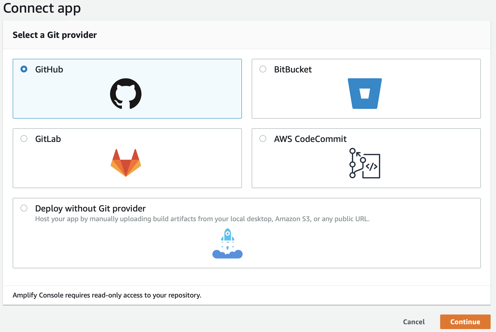
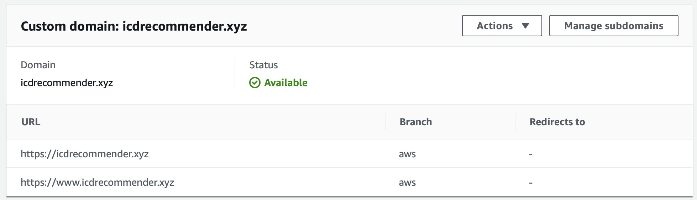
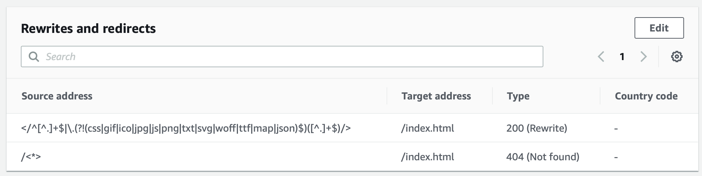

Pre-req: A running back-end server that provides: 
  - REST API for comminucation
  - OATH2 resource owner-based authentication
  - client id for OATH2

## Setting up local development server
1. Set up environment variables:
  - REACT_APP_CLIENT_ID
  - REACT_APP_SERVER_ADDRESS

2. Open terminal, navigate to root directory of this repo, and use the commands below.
Install dependencies using NPM:
```
npm install
```
Run node server:
```
npm start
```

## Deploying to AWS Amplify
1. From AWS Console for Amplify -> Deploy:

Select Github and click on Continue.
2. Select the repo and the desired branch from which to deploy the React JS app, and follow the steps to deploy.
3. The Amplify app should have the following environment variables:
- REACT_APP_CLIENT_ID
- REACT_APP_SERVER_ADDRESS
The REACT_APP_SERVER_ADDRESS should be set to match the subdomain record of the backend Route53, for example:
```
https://backend.icdrecommender.xyz
```
4. In the domain management, set up domains as the following:

5. In the Rewrites and redirects, set up the following:

Source:
```
</^[^.]+$|\.(?!(css|gif|ico|jpg|js|png|txt|svg|woff|ttf|map|json)$)([^.]+$)/>
```
Target:
```
/index.html
```
Source:
```
/<*>
```
Target:
```
/index.html
```

